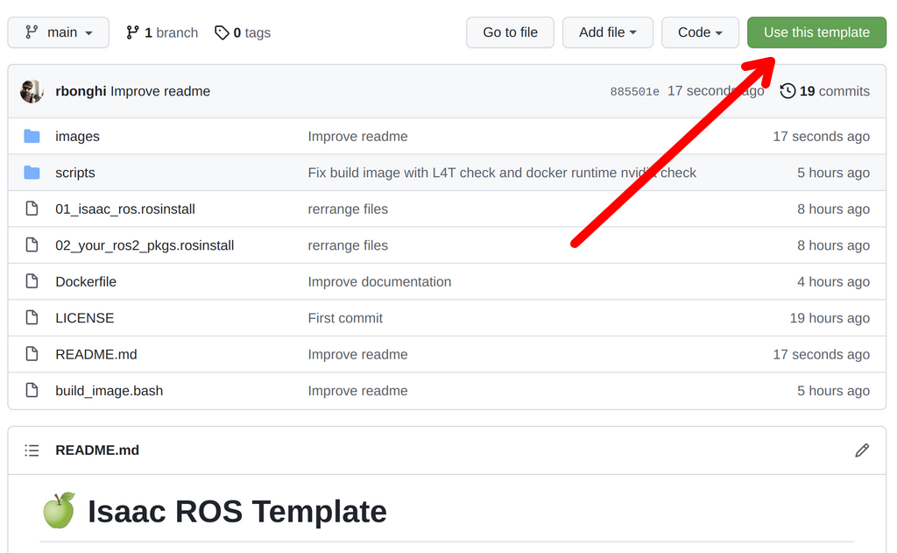
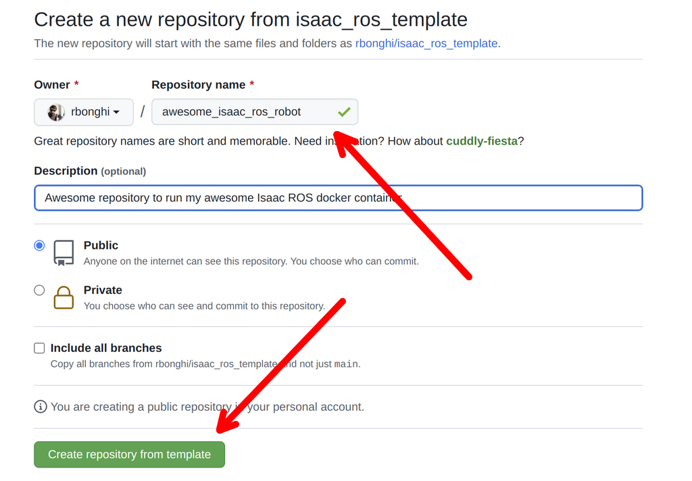
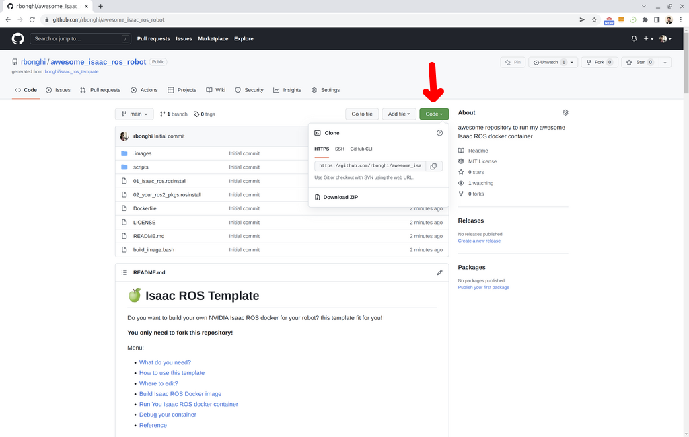

# 🍏 Isaac ROS Template

Do you want to build your own NVIDIA Isaac ROS docker for your robot? 

This template is made it for you! **You only need to fork this repository!**

Follow the steps below to be Isaac ROS GEMs dockerized:
 * [What do you need?](#what-do-you-need)
 * [How to use this template](#how-to-use-this-template)
 * [Where to edit?](#where-to-edit)
 * [Build Isaac ROS Docker image](#build-isaac-ros-docker-image)
 * [Run You Isaac ROS docker container](#run-you-isaac-ros-docker-container)
 * [Debug your container](#debug-your-container)
 * [Reference](#reference)

An example to use this template, watch this repository: [isaac_ros_realsense_example](https://github.com/rbonghi/isaac_ros_realsense_example)

# What do you need?

You need:
 * [NVIDIA Jetson](https://developer.nvidia.com/buy-jetson)
   *  NVIDIA Jetson AGX Xavier
   *  NVIDIA Jetson Xavier NX
   *  NVIDIA Jetson Nano (4Gb or 2Gb)
 * [NVIDIA Jetpack 4.6.1](https://developer.nvidia.com/jetpack-sdk-461)

If you are looking to build a docker container for **x86 machines**, please look the [NVIDIA Isaac common](https://github.com/NVIDIA-ISAAC-ROS/isaac_ros_common) repository 

# How to use this template

- Click on **Use this template** like the image below

------



------

- On the next dialog, write a new name for your repository you would like to start and decide if you want all of the branches, or just the latest Isaac ROS distribution.
- Click on **Create repository from this template** 

------



------

Github will then create a new repository with the contents of this one in your account. It grabs the latest changes as "initial commit".

- Now you can **clone your repo** as usual

------



# Where to edit?

There are three parts on this template to edit:
1. [Dockerfile](#dockerfile)
2. [01_isaac_ros.rosinstall](#01_isaac_rosrosinstall)
3. [02_your_ros2_pkgs.rosinstall](#02_your_ros2_pkgsrosinstall)

Let's move step by step and learn where you need to change

## [Dockerfile](/Dockerfile)

There are mainly 3 stage where you can work:
 * [**Stage 2**](#stage-2-install-dedicate-packages-for-isaac-ros) _(around line 128)_: "Install dedicate packages for Isaac ROS"
 * [**Stage 4**](#stage-4-install-your-ros2-dependecies) _(around line 161)_: "Install your ROS2 dependecies"
 * [**Stage 7**](#stage-7-write-your-runtime-command-at-startup) _(around line 206)_: "Write your runtime command at startup"

### (Stage 2) Install dedicate packages for Isaac ROS

If you are working with a specific Isaac ROS package, maybe you need to add specific dependecies.

Below a dependecies *example* that you need to install to for [Isaac ROS image segmentation](https://github.com/NVIDIA-ISAAC-ROS/isaac_ros_image_segmentation):

```Dockerfile
# Install Tao converter
RUN mkdir -p /opt/nvidia/tao && \
    cd /opt/nvidia/tao && \
    wget https://developer.nvidia.com/jp46-20210820t231431z-001zip && \
    unzip -j jp46-20210820t231431z-001zip -d /opt/nvidia/tao/jp4.6 && \
    chmod 755 $(find /opt/nvidia/tao -name "tao-converter") && \
    ln -sf $(find /opt/nvidia/tao -name "tao-converter")  /opt/nvidia/tao/tao-converter && \
    rm jp46-20210820t231431z-001zip
# Add Tao converter to PATH
ENV PATH="${PATH}:/opt/nvidia/tao"
```

**Remember to follow the [Docker writlines](https://docs.docker.com/develop/develop-images/dockerfile_best-practices/) guidelines to install al you need.**

### (Stage 4) Install your ROS2 dependecies

Like the [stage 2](#stage-2-install-dedicate-packages-for-isaac-ros) write in this stage all dependecies you need to be able to build your ROS2 packages.

**Remember to follow the [Docker writlines](https://docs.docker.com/develop/develop-images/dockerfile_best-practices/) guidelines to install al you need.**

### (Stage 7) Write your runtime command at startup

In this stage you need to uncomment the last line and write your specific launcher you want to run.

```Dockerfile
CMD ["ros2", "launch", "your_ros2_pkg", "your_launcher.launch.py"]
```

## [01_isaac_ros.rosinstall](/01_isaac_ros.rosinstall)

This *rosinstall* file collect all Isaac ROS repository you need to use for your robot.

Do you know how to make a rosinstall file? The full rosinstall documentation is available [here!](https://docs.ros.org/en/independent/api/rosinstall/html/rosinstall_file_format.html)

Briefly you need only to add after Isaac ROS common, 3 lines for each repository like below:

```yml
- git:
    local-name: <REPOSITORY NAME>
    uri: <REPOSITORY URL>
```

**PLEASE, DO NOT DELETE Isaac ROS common! It's always a repository needed in your Isaac ROS rosinstall portfolio**

## [02_your_ros2_pkgs.rosinstall](/02_your_ros2_pkgs.rosinstall)

Like [above](#01isaacrosrosinstall) you can add here all your workspaces you want to add in your Dockerfile

# Build Isaac ROS Docker image

```
bash build_image.bash [PROJECT_NAME]
```

**PROJECT_NAME** = Name project build

**Options:**
 * **-v** - Verbose
 * **-ci** - Build docker without cache
 * **--push** - Push docker image. Before to push, you need to be logged in
 * **--tag [TAG_NAME]** - Tag release (Default tag: *latest*)
 * **--pull-base-image** - Force to re-pull the base image

This script also *check* in the beginning if:
 1. You are running on ARM64 architecture
 2. Your NVIDIA Jetson have the [right requirements](#what-do-you-need)
 3. Your NVIDIA Jetson use the right NVIDIA runtime container and is able to build a certain of Isaac ROS packages

## Example output

Such as example if you want to build an image `isaac_ros_template` you will need to write:

`bash build_image.bash isaac_ros_template` where the docker image will be: `isaac_ros_template:latest`

# Run You Isaac ROS docker container

If you are reading this chapter, you are in the end of the process and you want to try Isaac ROS.

```
docker run --rm --network host [PROJECT_NAME]:latest
```

What are means the options above:
 * **--rm** - When you switch off the container will be also deleted
 * **--network host** - This container will share the network with the host. This option is helpful to read all topics from your host or from your laptop.

 If you want to leave this container, you need only to press `CTRL-D`.

**Hint:** there are devices that need to be conneted with your container. You can also add the option **--device** or **--privileged**.

## Docker Compose

Another way to use your docker image, is make a docker compose file, if you never hear that, watch the [documentation](https://docs.docker.com/compose/)

Write a file called `docker-compose.yml` and write like below:

```yml
version: "3.9"
services:
  isaac_ros_service: 
    image: [PROJECT_NAME]:latest
    network_mode: host
    volumes:
      # If you are working with a MIPI camera
      # you need to uncomment the line below
      # - "/tmp/argus_socket:/tmp/argus_socket" 
```

If you want to run this compose, remember to use:

```
docker compose up
```

## Example output

If you have build your image with `isaac_ros_template` the command will be like:

`docker run --rm --network host isaac_ros_template:latest`

# Debug your container

A good way to work with your docker image and check works well or is well built, you can use the command below

```
docker run --rm --network host -it [PROJECT_NAME]:latest bash
```

This command, will make a new container with a bash attached on your current terminal and you will be able to work on it. If you want to leave this container, you need only to press `CTRL-D`.


If you want to test meanwhile the docker is running you can use:

```
docker exec -it <DOCKER_CONTAINER_NAME> bash
```

In this case, your terminal will be attached to the your docker Isaac ROS container.

# Reference

* [NVIDIA Isaac](https://developer.nvidia.com/isaac)
* [NVIDIA Isaac ROS GEMs](https://developer.nvidia.com/isaac-ros-gems)
* [NVIDIA Isaac ROS GEMs repositories](https://github.com/NVIDIA-ISAAC-ROS)
* [NVIDIA Jetson](https://www.nvidia.com/en-gb/autonomous-machines/embedded-systems/)
* [NVIDIA Jetson containers](https://github.com/dusty-nv/jetson-containers)
* [NVIDIA Jetpack](https://developer.nvidia.com/embedded/jetpack)

Developer blog posts and webinars:
 * [Integrating Isaac ROS Visual Odometry GEM on Jetson](https://info.nvidia.com/isaac-ros-and-nvidia-jetson-wbn.html)
 * [Isaac ROS tutorial](https://github.com/rbonghi/isaac_ros_tutorial) Many examples to build your own docker for Isaac ROS
 * [Designing Robots with NVIDIA Isaac GEMs for ROS](https://developer.nvidia.com/blog/designing-robots-with-isaac-gems-for-ros/)


Robot example with Isaac ROS:
 * [nanosaur.ai](https://nanosaur.ai)
 * [nanosaur architecture](https://nanosaur.ai/architecture/)
 * [nanosaur_perception](https://github.com/rnanosaur/nanosaur_perception) GPU accelerated repository
